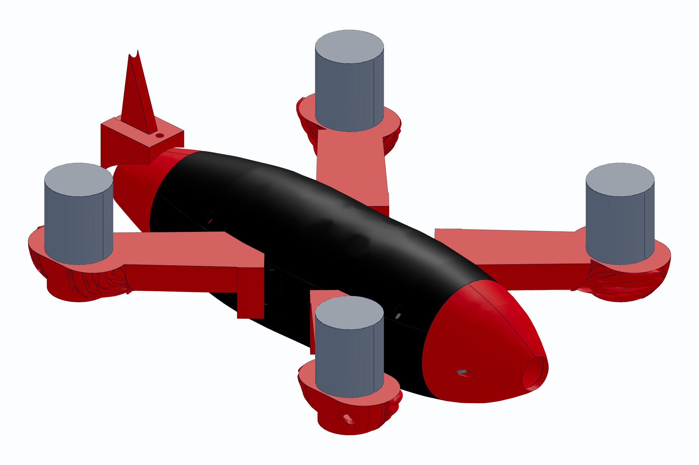

# VYPER

A fully 3D-printed high-speed FPV quadcopter, generated from parametric CAD
and verified by an automated test suite. Inspired by the
[Peregreen V4](https://airshaper.com/cases/peregreen-v4-fastest-drone) — the
3D-printed quadcopter that set the Guinness record at 657.59 km/h.



| | |
|---|---|
| All-up weight | **567 g** |
| Thrust-to-weight | **8.1 : 1** |
| Drag area (CdA) | **39.4 cm²** — about half an open racer |
| Top speed | 139 km/h — **prop-pitch limited, not thrust limited** |
| Fuselage | 52 × 300 mm, fineness 5.77 |
| Bill of materials | **$142** |
| Automated checks | **30, all passing** |

---

## What's here

| | |
|---|---|
| [`vyper_shell.py`](vyper_shell.py) | The whole airframe in one CadQuery script — shell, arms, hub |
| [`test_vyper.py`](test_vyper.py) | 24 checks: fit, printing, tolerances, aero, mass |
| [`vyper_assembly.py`](vyper_assembly.py) | Assembly for review renders |
| [`firmware/`](firmware/) | Betaflight config + bench and pre-flight procedure |
| [`docs/BOM.md`](docs/BOM.md) | Every part, exact dimensions, links |
| [`pcb/`](pcb/) + [`docs/PCB_DESIGN.md`](docs/PCB_DESIGN.md) | Custom VYPER-F4 flight controller: KiCad 9 board, 15 interaction checks, dimensioned drawing |
| [`docs/TEST_REPORT.txt`](docs/TEST_REPORT.txt) | Latest full test output |
| [`stl/`](stl/) | Ready-to-print STLs |

```bash
pip install cadquery
python test_vyper.py      # verify
python vyper_shell.py     # build
```

---

## Design notes

**Von Kármán (LD-Haack) ogive nose** — the analytically minimum-drag nose for a
given length and base diameter, not a stylistic guess:

```
θ(x) = arccos(1 − 2x/L)
r(x) = (R/√π) · √(θ − sin(2θ)/2)
```

It meets the parallel body with zero slope discontinuity, so there's no
shoulder to trip the flow.

**Arms swept 22° aft, motors not canted.** On a tail-sitter the body axis *is*
the flight direction at speed, so a swept strut sees only the crossflow
component and its profile drag falls as cos²(sweep). The motor pads stay normal
to the body axis, so thrust is never canted — tilting the motors themselves
would cost 3.4 % of thrust at 15° and buy nothing here.

**Pusher, not tractor.** Motors bolt to the *aft* face of the arms with the
props behind them. A tractor gives the prop clean inflow, but its slipstream
then washes the entire fuselage above freestream velocity — and skin friction
scales with local dynamic pressure over what is nearly all the wetted area
there is. A pusher costs the prop some inflow quality and keeps the body in
clean air, which is the larger effect here. It is also why high-speed UAVs are
overwhelmingly pushers.

Consequence: motors are **inverted**, so all four directions reverse in
BLHeli/AM32 and `yaw_motors_reversed = ON`. Get that wrong and it flips on
yaw the instant you arm.

**Wire routing.** A 6 mm bore runs the length of each blade from the motor
pocket to the root, exiting inside the cavity — three 20 AWG leads (~4 mm
bundled) pull through by hand. Nothing flaps in a 139 km/h airstream. Bored
along the blade axis so it prints as a horizontal hole and bridges cleanly.

**Boat-tailed nacelles.** The pad's axis lies along the flow, so it behaves as
a nacelle and its drag is base drag off the flat aft end. Tapering to 45 %
radius removes most of that.

**Motor screws: M3×8 into a 4.0 mm pad** = 4.0 mm engagement in a 4.5 mm blind
thread. Washers under every head, because the pad is PETG and vibration embeds
a bare head over time. Threadlocker in the motor's aluminium thread, never on
the plastic.

---

## Three things the tests taught me

**Top speed was never thrust-limited.** 3.6 N of drag against 44 N available.
The ceiling is propeller pitch speed. Cutting drag doesn't raise it — it lowers
the power needed to hold it. That reframed the project: the fairing buys
efficiency and flight time, not speed.

**The tests caught what renders didn't.** A hub that exported as four
disconnected wedges. An arm frontal area computed against the wrong axis,
overstating its drag by 4.3×. A spline that self-intersected into a negative
volume. All of them looked fine on screen.

**Cheaper parts made it faster.** Re-specifying to $150 meant a smaller stack
and battery, which let the fuselage go 60 → 52 mm and lose 25 % of its frontal
area. The expensive ESC had been setting the diameter all along.

---

## Status and honesty

This is a **verified design, not a flown aircraft.** Everything here is checked
in software; none of it has been in the air. Treat the first build as a
prototype.

Known open items:
- **Motors are 84 % of remaining drag.** Fairing them is the biggest gain left.
- The fuselage is a sealed tube — there's a mandatory thermal bench check in
  [`firmware/PREFLIGHT.md`](firmware/PREFLIGHT.md) before you fly it.
- The $142 BOM covers the **aircraft only**. Radio, goggles and charger are a
  further $175–325 and you cannot fly without them.

## Safety

A 567 g aircraft at 139 km/h behind four unguarded props will cause serious
injury. Props off for all bench work. Fly only where regulations allow and
where nobody else is.

MIT licensed.
