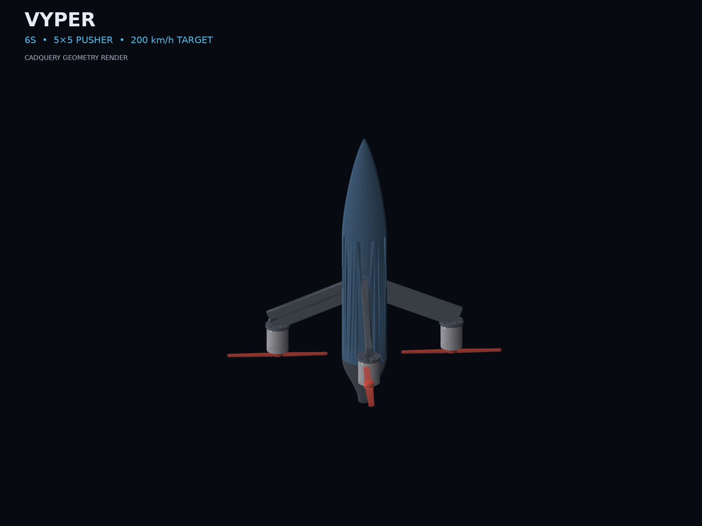
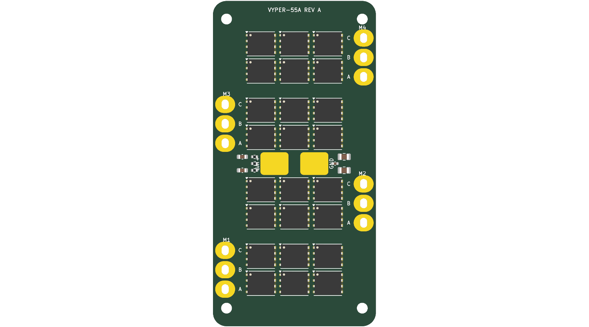
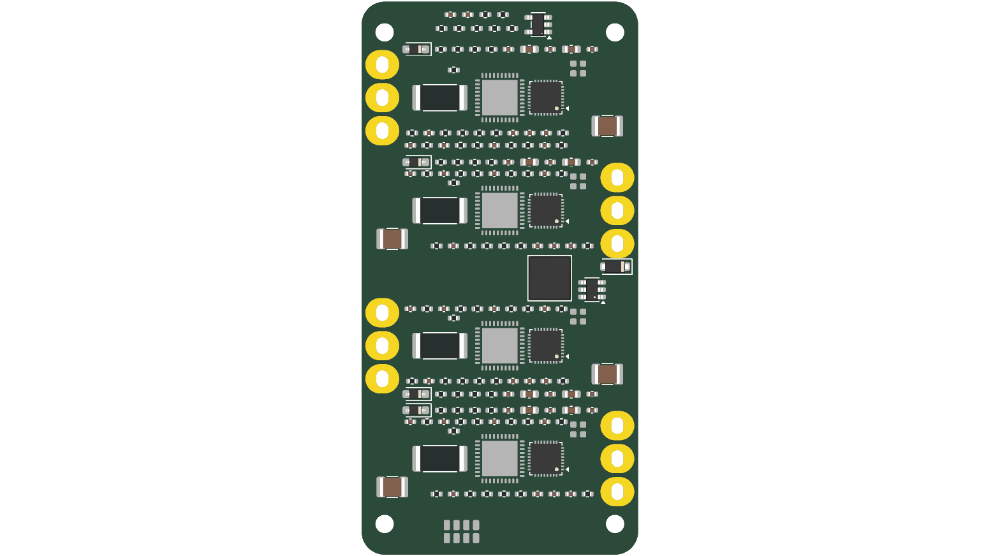
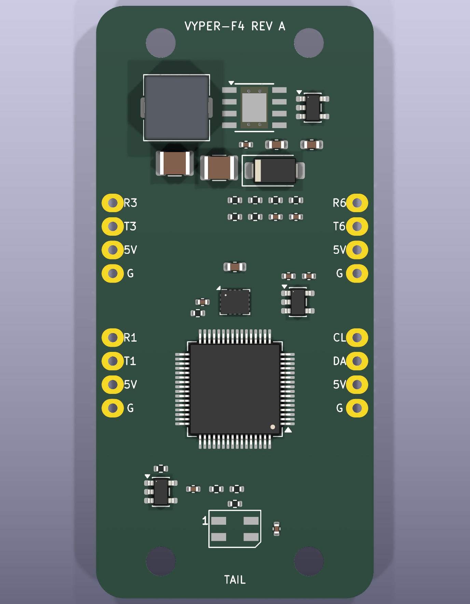
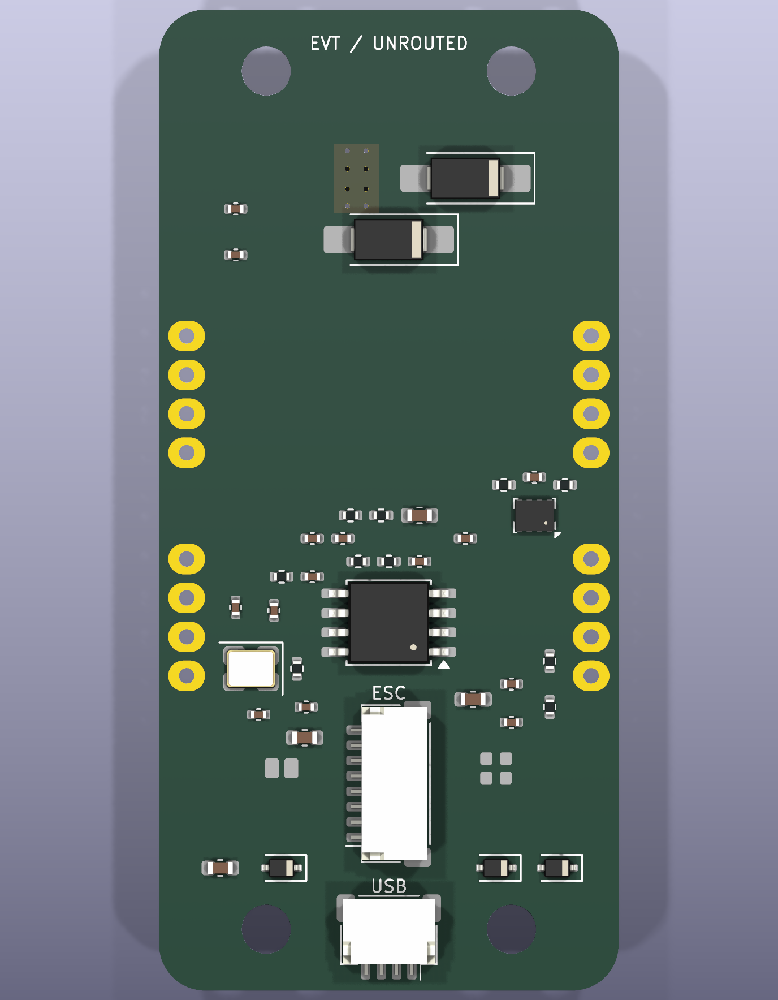

# VYPER

VYPER is a parametric, Neptune-4-printable, rocket-body FPV quadcopter concept
with a true-X arm layout and rear-facing pusher propellers. It is inspired by
the packaging and drag-reduction approach of high-speed record drones such as
[Peregreen V4](https://airshaper.com/cases/peregreen-v4-fastest-drone); it is
not a copy and it is not a speed-record claim.



| Screening result | Current value |
|---|---:|
| Estimated all-up mass | 715 g |
| Static thrust-to-weight estimate | 8.8:1 |
| Analytical CdA build-up | 40.0 cm² |
| Target speed | 200 km/h, unproven |
| Ideal 5-inch prop pitch speed | 241 km/h |
| Required pitch efficiency at target | 83% |
| Fuselage envelope | Ø57 × 360 mm including tail |
| OrcaSlicer PETG mass | 257.1 g |

The speed result is an analytical feasibility screen, not CFD and not flight
data. Only two-direction radar or validated high-rate GNSS testing can establish
the aircraft's real speed.

## Repository contents

- `vyper_shell.py`: parameterized shell, split nose, four printed arms,
  internal hub, removable vertical electronics cassette and retained boat-tail.
- `vyper_assembly.py`: fit-check assembly with the selected battery, motors,
  props, board envelopes, camera/VTX/RX and exact M3×8 STEP fasteners.
- `stl/` and `cad/`: regenerated printable STL and STEP files.
- `test_vyper.py`: solid, fit, clearance, fastener, mass and first-order aero
  checks.
- `pcb/`: VYPER-F4 FC floorplan plus the VYPER-55A custom ESC EVT architecture,
  authored netlists, true-footprint unrouted review board and independent tests.
- `docs/BOM.md`: current purchased-part envelopes, budget and sourcing status.
- `docs/VALIDATION_GATES.md`: the tests required before LiPo power and flight.

```bash
source .venv/bin/activate
python test_vyper.py
python pcb/test_vyper_f4.py
python pcb/test_vyper_f4_netlist.py
python pcb/test_vyper_f4_drc.py
python pcb/test_vyper_esc.py
python pcb/test_vyper_esc_netlist.py
python firmware/am32/test_target.py
python vyper_shell.py
python vyper_assembly.py
python render_vyper.py
```

## Geometry

The center body is not two crossed chopsticks. It is a hollow Ø57 mm body of
revolution with a Von Kármán ogive, a removable cosine boat-tail and four
separate swept blade arms at 45/135/225/315 degrees. The motor pads remain
normal to the flight axis, so arm sweep does not cant thrust. Motors and props
are on the aft faces in pusher configuration.

Each 8×26 mm printed arm contains a Ø5.5 mm motor-wire bore. Adjacent 5-inch
prop discs have 28.6 mm tip clearance and clear the body by 18.0 mm. The 81×39×33
mm 6S battery has 0.96 mm radial fit allowance in the 53 mm internal diameter.

## Electronics status

Two paths are intentionally separated:

1. The under-$200 prototype budget uses a purchased 6S F405/55–60 A stack.
   That is the only sensible path for initial restrained and low-speed tests.
2. The custom FC and custom four-channel ESC are development boards. The FC is
   presently a validated 30×64 mm R3 vertical floorplan plus a 58-net / 77-component
   authored design and true-footprint four-layer review board. All 58 passives
   are in-outline, and all 250 nodes reach pads without placement/copper DRC
   errors, but 192 connections remain unrouted. It includes the ICM-42688-P,
   BMP280, blackbox, voltage/current sensing, external compass/GPS interfaces,
   and a level-shifted addressable RGB status LED. The reviewed graphical
   schematic is also open. The ESC has a validated 36×72 mm R3 vertical
   floorplan with 52 modeled major/support courtyards, a 159-net / 195-component authored electrical
   design, an AM32 target, and a six-layer true-footprint review board. All 715 authored
   netlist nodes reach physical pads, but KiCad correctly reports 499 unrouted
   connections. Neither custom board is orderable or flight-qualified yet.

The custom ESC's 55 A label is a **2-second design target**, not a tested
continuous rating. See [`pcb/FC_ARCHITECTURE.md`](pcb/FC_ARCHITECTURE.md) and
[`pcb/ESC_ARCHITECTURE.md`](pcb/ESC_ARCHITECTURE.md).

| ESC MOSFET / cooling face | ESC control / support face |
|---|---|
|  |  |

| FC power / sensor face | FC interface face |
|---|---|
|  |  |

## Known blockers before a physical build

- Add and fit-check a camera optical window/fairing in the shell.
- Complete reviewed graphical schematics and both boards' routing, ERC/DRC and
  manufacturing outputs.
- Print and weigh coupons; G-code now estimates 257.1 g and 14 h 39 min, but
  real spool density, flow calibration and failed-print allowance remain.
- Print tolerance coupons and proof-load an arm before installing a motor.
- Validate cooling and switch-node transients inside the closed fuselage.

## Safety

This is an unflown prototype with four unguarded 5-inch propellers and a high-
energy 6S LiPo. Props stay off for configuration and low-energy electronics
work. Custom ESC bring-up starts on a current-limited bench supply, never a
LiPo. Follow [`docs/VALIDATION_GATES.md`](docs/VALIDATION_GATES.md) and local
aviation/radio rules.

MIT licensed.
