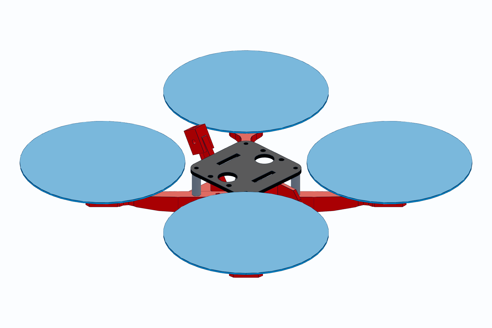

# VYPER-5

A 5-inch, 6S, true-X FPV racing quadcopter. The entire airframe is 3D printed
on an Elegoo Neptune 4 in PETG. Six parts, no supports, no carbon fibre.

**Printed frame mass: 76 g. AUW with a 6S 1050: ~543 g. Static thrust ~6.4 kg.
Thrust-to-weight ~11.8:1.**



*Blue discs are the prop keep-out volumes, drawn at true 127 mm diameter — not
parts. Everything tall on the airframe is verified to sit outside them.*

---

## The honest version of "under $200"

**$200 buys the aircraft and one battery. It does not buy a radio, goggles, or
a charger.** Those are another **$180-300** and you cannot fly without them.
If you already have them, this is a complete build. If you don't, read
[docs/BOM.md](docs/BOM.md) before ordering anything.

The $200 target is also only reachable at **AliExpress prices**. The same build
from US retailers is about **$306** — I verified that spread against live
listings, and both columns are in the BOM.

---

## Why this design works

The obvious objection to a printed racing frame is that plastic is weak. It is
— in the wrong direction. FDM parts are strong along the extrusion and weak
between layers, so the whole design is arranged around print orientation rather
than around what looks good in CAD.

**The arm is the entire argument.** It is a cantilever: 19 N of thrust at the
tip, clamped at the root, so the load is bending — tension on one face,
compression on the other, both running along the arm. So:

- The **top face is flat over the full length** and that face is what goes on
  the bed. It is the motor mounting surface: dead flat, best finish on the part.
- **All the taper is on the underside**, so cross-section only ever shrinks
  going up from the bed. Not one overhang. No supports anywhere on any part.
- Peak bending fibres end up as **continuous perimeter extrusions** running the
  full 111 mm. Layer adhesion only ever sees transverse shear — about 0.6 MPa,
  two orders of magnitude inside what the bond can take.
- Depth follows the bending moment instead of being a straight ramp, so stress
  stays flat at **5-8 MPa** along the span instead of spiking just inboard of
  the motor pad, which is where a linear taper always breaks.

At full static thrust the arm root runs **~4 MPa against ~45 MPa PETG yield**.
Under a 10 g arm-tip impact it is ~12 MPa. It still passes, and it is 9.9 g and
about 60 cents to reprint.

**The weight penalty is smaller than you'd expect.** At 76 g the printed frame
is actually *lighter* than most 5" carbon frames (100-130 g with hardware),
because material only exists where a load path exists — the bottom plate is an
X, not a slab. And at 5"/6S there is so much thrust that even a heavy frame
would not hurt: T/W is ~11.8:1.

**It will still break in crashes.** That is the trade, and it is the point. A
carbon arm costs $12 and a week of shipping. This one costs 60 cents and 40
minutes.

---

## Specs

| | |
|---|---|
| Class | 5" / 220 mm wheelbase, true X |
| Prop | 5x4.3x3 tri-blade (127 mm) |
| Motors | 2207 1750KV, 6S |
| Battery | 6S 1050 mAh LiPo, top mounted |
| Printed frame | 76 g (6 parts) |
| Dry weight | ~358 g |
| AUW | ~543 g |
| Static thrust | ~6.4 kg |
| Thrust-to-weight | ~11.8:1 |
| Hover throttle | ~8.5% of max thrust |
| Adjacent prop tip gap | 28.6 mm |
| Bed footprint (largest part) | 111 x 26 mm |

Top speed for this power/weight class is roughly **140-160 km/h (90-100 mph)**
in a straight line. The printed frame has slightly more frontal area than
carbon, so treat the bottom of that range as the realistic number.

---

## Files

```
stl/          print these
cad/          build123d generators + STEP
docs/         BOM, printing, assembly
```

| Part | Qty | Mass | STL |
|---|---|---|---|
| Arm | 4 | 9.9 g | [stl/arm.stl](stl/arm.stl) |
| Bottom plate | 1 | 13.6 g | [stl/bottom_plate.stl](stl/bottom_plate.stl) |
| Top plate | 1 | 9.8 g | [stl/top_plate.stl](stl/top_plate.stl) |
| Camera cage | 1 | 6.8 g | [stl/camera_cage.stl](stl/camera_cage.stl) |
| Antenna mount | 1 | 6.3 g | [stl/antenna_mount.stl](stl/antenna_mount.stl) |
| Standoff (optional) | 4 | 0.5 g | [stl/standoff.stl](stl/standoff.stl) |

Every dimension lives in [cad/vy_params.py](cad/vy_params.py). Change the
wheelbase, prop size, or motor pattern there and regenerate.

---

## Regenerating the CAD

```bash
cd cad && ../.venv/bin/python verify.py
```

`verify.py` is not decoration. It intersects the frame against real prop
keep-out solids, checks every printed part against every other for overlap,
checks the camera's sightline against the battery nose, and checks bed fit.
It caught three genuine errors during design: an 0.8 mm stack-up error, a
camera cage that ran into the front arms, and an antenna blade clipping the
top plate. **Run it after any parameter change.**

```bash
cd cad && ../.venv/bin/python \
  ~/.claude/skills/cad/scripts/step arm.py --stl ../stl/arm.stl --force
```

---

## Read next

- [docs/BOM.md](docs/BOM.md) — what to buy, real prices, what is *not* included
- [docs/BUILD.md](docs/BUILD.md) — print settings, orientation, assembly order

Safety, briefly: a 6S 5" quad carries 6.4 kg of thrust behind four unguarded
carbon-filled blades at 30,000+ RPM. It will take fingers off. Props off for
every bench test, and fly it somewhere with nobody in it.
