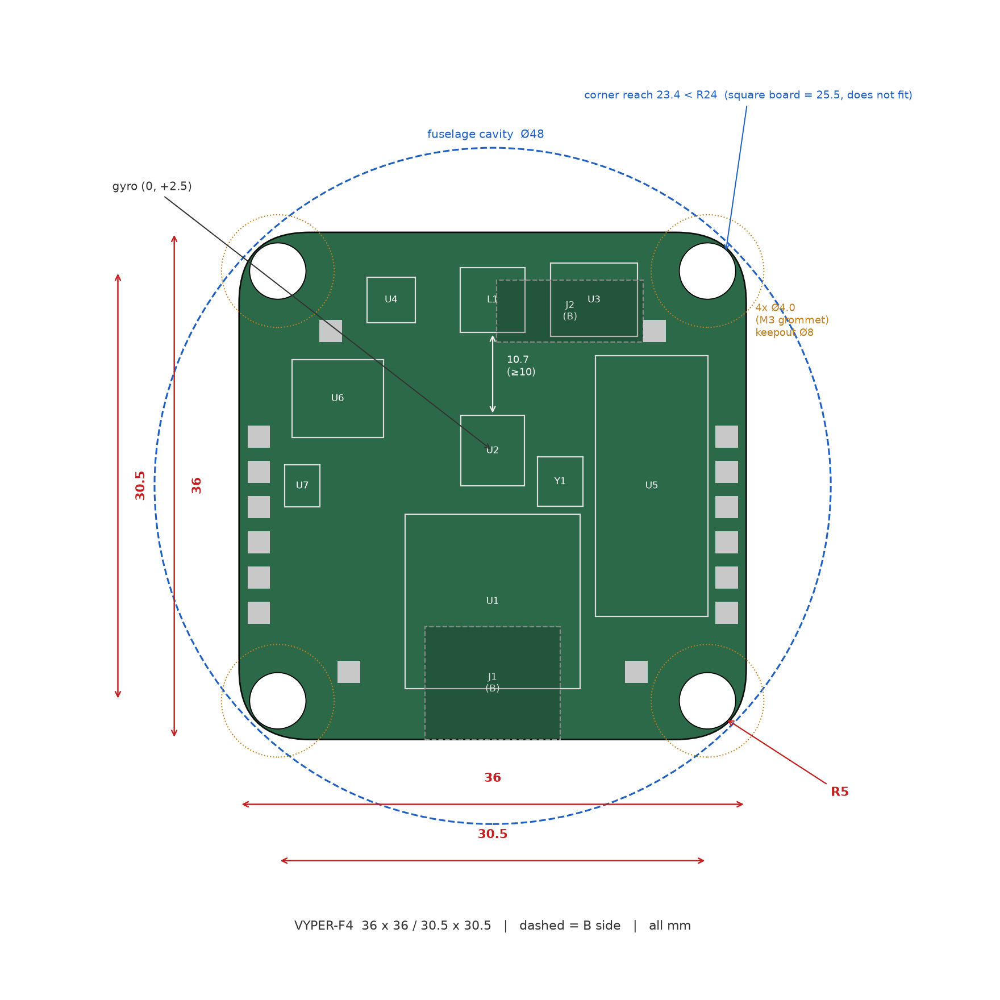

# VYPER-F4 — custom flight controller PCB

A placement-complete, dimensionally verified KiCad board for the VYPER
airframe. **15 automated interaction checks pass** (`pcb/test_vyper_f4.py`).



## What exists and what doesn't — read this first

| Done | Not done |
|---|---|
| Board outline, cut to the fuselage | Schematic capture (netlist) |
| 30.5×30.5 Φ4.0 grommet holes | Copper routing |
| Every major part placed, real package sizes | DRC against a fab profile |
| Courtyard / hole / pad interaction checks | Ordering files (gerbers/BOM/CPL) |
| KiCad 9 file that opens clean | |

That split is deliberate. Placement and dimensions are where an FC spin
dies silently — a board that doesn't fit its frame, holes that eat a
courtyard, a gyro next to an inductor. Routing is real work too, but it
fails *loudly* in DRC. Do it in the KiCad GUI or hand the placed board to an
AI router (below).

## The AI-tool landscape (researched July 2026)

| Tool | What it actually does | Use here? |
|---|---|---|
| [Quilter](https://www.quilter.ai/blog/the-2026-guide-to-autonomous-pcb-design-quilter-vs-deeppcb-vs-flux-ai) | Physics-driven cloud place-and-route of a *finished schematic*. Free tier. | **Yes** — best fit for routing this board once the netlist exists |
| [DeepPCB](https://www.protoflow.ai/compare/ai-pcb-autorouter-comparison) (InstaDeep) | RL-based cloud autorouter, free tier + pay-as-you-go | Yes, alternative router |
| [Flux.ai](https://www.protoflow.ai/compare/best-ai-pcb-design-software-2026) | Browser ECAD with AI copilot; explicitly *not* a full autorouter — route critical nets by hand, let it finish | Maybe, if you want schematic + layout in one tool |
| KiCad 9 + this repo | Deterministic generation from a Python layout file | What we did |

None of them design a *flight controller* for you: every tool above starts
from a schematic and placement intent. The intelligence in an FC layout is the
placement rules — which is exactly the part encoded and tested here.

## Design principles applied (and where each came from)

Sources: [Betaflight manufacturer design guidelines](https://betaflight.com/docs/development/manufacturer/manufacturer-design-guidelines),
[PCBSync drone PCB engineering guide](https://pcbsync.com/drone-pcb-design/),
[AllPCB flight-control layout guide](https://www.allpcb.com/allelectrohub/the-ultimate-guide-to-drone-flight-control-pcb-design-optimizing-for-performance-and-reliability).

1. **Gyro near the rotation centre, on the board axes.** ICM-42688-P at
   (0, +2.5) — 2.5 mm off centre, limit 4. A FWD axis mark is on the silk
   because a rotated gyro is a config error you chase for a week.
2. **Gyro ≥ 10 mm from anything that switches.** The buck inductor's field
   couples into the MEMS structure and reads as vibration that no filter
   fully removes. Measured on this board: **10.7 mm**, checked.
3. **Gyro-to-MCU SPI under 10 mm.** Courtyard gap here: ~0.8 mm.
4. **Soft mounting is a requirement, not a preference.** Hard-bolting the
   board flexes it and permanently shifts gyro bias — hence Φ4.0 holes for
   M3 grommets and a Φ8 keepout ring at each corner *on both faces*.
5. **Solid ground under the IMU; 4-layer stack** (sig / GND / PWR / sig)
   when routed — a continuous plane under high-frequency parts is the
   cheapest EMI fix there is.
6. **Power entry short and fat, cap at the connector.** Battery spikes on
   6S/4S kill FCs; the 470 µF low-ESR lives at the XT60, not on this board.
7. **USB and ESC socket on the bottom face** — the ESC harness plugs
   straight up from the stack below; USB faces the open tail of the
   fuselage. This is a case where the *airframe* dictated the PCB.

## Why the board is shaped by the fuselage

Two findings the checks enforce forever:

- **A square 36×36 board does not fit the VYPER fuselage.** Cavity radius is
  24 mm; a square board's half-diagonal is 25.46 mm. Corner radius ≥ 3.5 mm
  is *structural to the fit*; we use R5 → 23.38 mm reach, 0.6 mm air.
- **The classic corner motor-pad position is illegal on this board.** At
  (±13, ±13) all four pads sit inside the grommet keepouts — and M3
  additionally landed inside the blackbox-flash courtyard. The checks caught
  both; pads moved inboard.

## ESC: researched, deliberately not DIY'd

The same research pass covered ESC layout (gate-drive loops, shunt placement,
FET thermal spreading, bulk capacitance per phase). Conclusion: a 40 A 4-in-1
ESC is a **power-electronics project with a failure mode that takes the
battery with it**, on a board that costs $30 to buy with AM32 already on it.
Custom FC: sensible learning project. Custom ESC on a first spin: not.
Principles are in the sources above if you want them.

## Reproduce

```bash
cd pcb
python3 vyper_f4_gen.py                 # emit vyper_f4.kicad_pcb
python3 test_vyper_f4.py                # 15 interaction checks
../.venv/bin/python vyper_f4_drawing.py # dimensioned drawing
kicad-cli pcb render --side top --output top.png vyper_f4.kicad_pcb
```

The `.kicad_pcb` opens directly in KiCad 9 for schematic-linking and routing.
